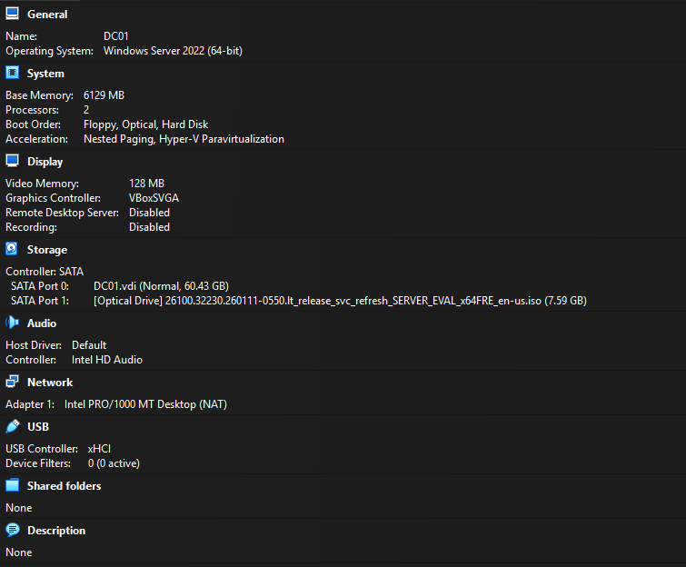
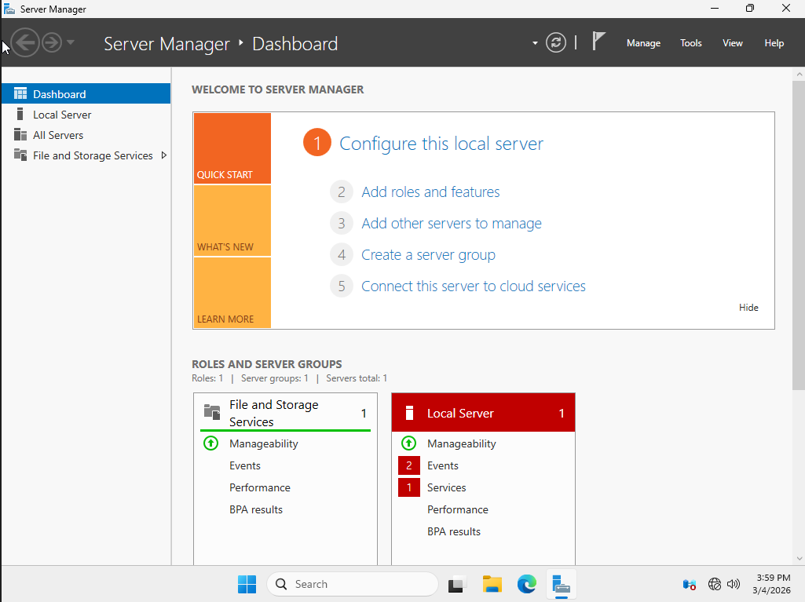
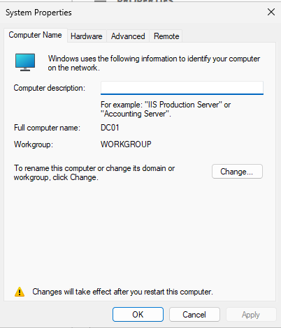
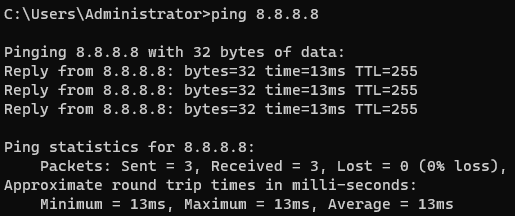

# Active Directory Homelab

## Overview
This project uses VirtualBox to create and document my Windows Server homelab envrionment.
The goal for this homelab is to gain hands-on experience with enterprise IT infrastructure concepts including server administration, networking, and preparation for Active Directory deployment.

---

## Environment

| Component | Configuration |
|-----------|--------------|
| Hypervisor | VirtualBox |
| Operating System | Windows Server 2025 (Desktop Experience) |
| Server Hostname | DC01 |
| Network Mode | NAT |

---

## System Setup

### Virtual Machine Deployment
A Windows Server virtual machine was created in VirtualBox and configured with the needed system resources.

---

### Windows Server Installation
Windows Server 2025 (Desktop Experience) was installed and basic system configuration was completed.

---

### Server Renaming
I changed the default hostname generated by Windows to **DC01**, to follow common naming conventions for domain controllers.

---

### Network Connectivity Verification
Network connectivity was verified.

Commands used: `ipconfig` and `ping 8.8.8.8`

---

## Skills Demonstrated

- Windows Server administration
- Virtual machine deployment
- Network configuration and troubleshooting
- Command line diagnostics
- Basic infrastructure preparation for Active Directory

